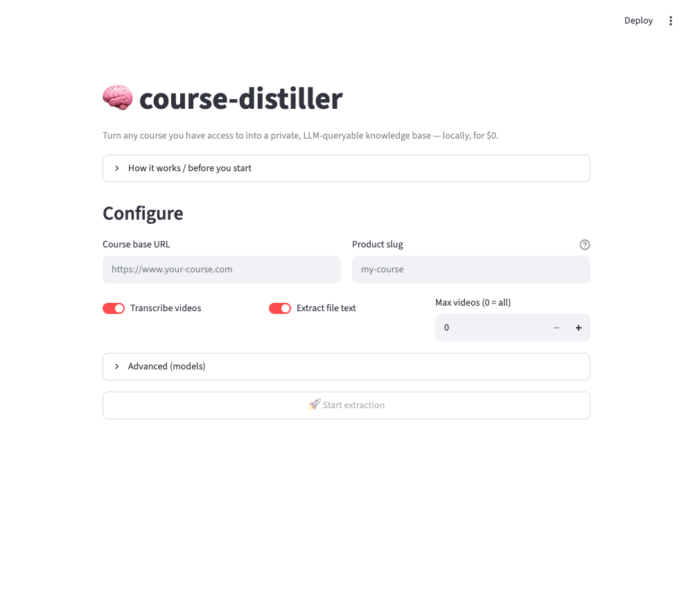
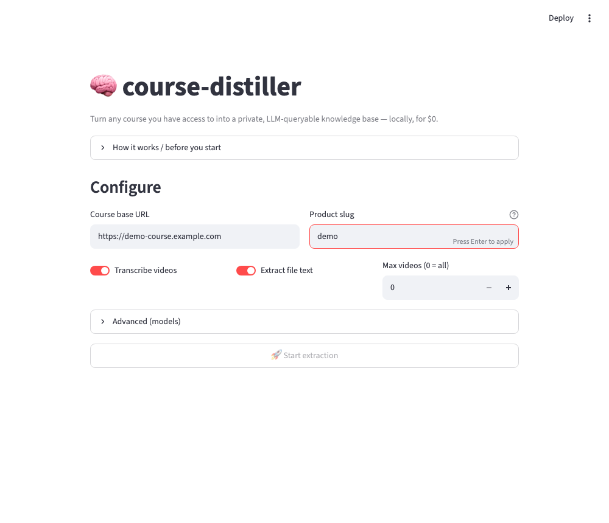
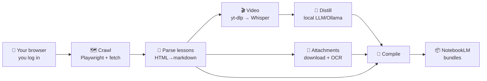

<h1 align="center">🧠 course-distiller</h1>

<p align="center">
  <b>Turn a course you have access to into a private, LLM-queryable knowledge base — locally, for $0.</b>
</p>

<p align="center">
  
  
  
  
</p>

> **Scope:** course-distiller is built for **Kajabi-style courses** (`/products/…/categories/…/posts/…`)
> with **Wistia** video. Other platforms work once someone adds an adapter (see
> [Architecture → Extending](docs/ARCHITECTURE.md)). Know this before you install the dependencies.

---

<p align="center"></p>

## The problem

Great courses are locked inside video players and PDFs. You can't search them, can't ask them
questions, and re-watching a 90-minute recording to find one framework is painful. Tools like
NotebookLM answer questions over text brilliantly — *if only you had the text.*

**course-distiller** produces exactly that: a clean markdown knowledge base — lesson text,
**distilled video transcripts**, **extracted PDF/slide content**, and every link/contact/form —
ready for NotebookLM or any LLM. It runs entirely on your machine. No API bills, no uploading your
paid content to a third party.

## What you get

```
output/
├── lessons/              # one markdown file per lesson, grouped by section
├── notebooklm/           # consolidated per-section bundles — upload these to NotebookLM
├── _INDEX.md             # clickable map of the whole course
└── PROTOCOLS.md          # auto-aggregated contacts, forms, and resource links
```

Each lesson file contains the portal text, a **distilled transcript** of its video, the **extracted
text of its attachments**, and all resource links — verbatim.

## Using it (web UI walkthrough)

```bash
streamlit run app.py
```

1. **Configure** — paste your course's base URL and product slug, toggle video/attachments, pick models.

   

2. **Start** — a browser window opens. **You** log in to your course there (the tool never sees your
   password). It detects the login and begins.
3. **Watch** — a live dashboard shows each phase: 🗺️ map → 📄 harvest → 🎬 transcribe → 🔍 extract → 📦 bundle.
4. **Download** — when it finishes, grab the NotebookLM bundles as a zip and drop them into one notebook.

Prefer the terminal? `cp config.example.yaml config.yaml`, edit it, then `python -m coursedistiller.run`.

## How it works



See [docs/ARCHITECTURE.md](docs/ARCHITECTURE.md) for the design decisions (graph-closure crawl,
resumability, why the models take turns).

## Install

**Prerequisites** (one-time):
```bash
brew install ffmpeg poppler tesseract        # macOS (Linux: apt install ffmpeg poppler-utils tesseract-ocr)
# Ollama for local distillation — https://ollama.com
ollama pull gpt-oss:20b                       # or any local model you like
```
**The tool:**
```bash
git clone https://github.com/M19K/course-distiller && cd course-distiller
python -m venv .venv && source .venv/bin/activate
pip install -r requirements.txt
playwright install chromium
```

## ⏱️ Time & hardware expectations

**Whisper (video transcription) is the long pole.** Everything else — crawling, parsing, downloading,
distilling — is minutes. Transcription time depends almost entirely on your hardware:

| Machine | Whisper backend | ~Speed | A 40-lesson course (~7 hrs of video) |
|---|---|---|---|
| **Apple Silicon (M-series)** | `mlx-whisper` | ~10–13× realtime | **~40–60 min** |
| Intel / AMD, no GPU | `openai-whisper` (CPU) | ~0.5–1× realtime | **several hours** |
| NVIDIA GPU | `openai-whisper` (CUDA) | ~5–10× realtime | ~1–1.5 hr |

- **Text only** (toggle video off): the whole course in **a couple of minutes**.
- **RAM:** a 20B distill model needs ~16 GB. On a tight machine, use a smaller Ollama model, or set
  `distill.enabled: false` (you'll get raw transcripts instead of notes).
- **Tip:** use `video.max_videos` to transcribe a handful first and sanity-check output before a full run.

## 📂 Worked example

See [`examples/`](examples/) for a complete walkthrough — a sample `config.yaml`, the command to run,
and the exact output tree you should expect (with a real compiled lesson).

## Configuration

Everything lives in `config.yaml` (copy [`config.example.yaml`](config.example.yaml)): course URL,
whether to transcribe video, which Whisper/LLM models, politeness pacing, OCR, and more.

## 🩺 Troubleshooting

| Symptom | Fix |
|---|---|
| **"Login not detected within timeout"** | Finish logging in inside the opened browser window; it polls for lesson content. Slow to log in? Increase the timeout in `crawl.py`. |
| **Distillation empty / `Connection refused`** | Ollama isn't running: `ollama serve`, then `ollama pull <model>`. Or set `distill.enabled: false`. |
| **A video won't download** | It may not be Wistia-hosted. Update `yt-dlp` (`pip install -U yt-dlp`); check the lesson's embed. |
| **`pdftotext` / `tesseract: not found`** | Install poppler + tesseract (see Prerequisites). |
| **`playwright: executable doesn't exist`** | Run `playwright install chromium`. |
| **Whisper very slow or out-of-memory** | Use a smaller model (`small`, `distil-large-v3`), close other apps, or turn video off. |

## ⚖️ Ethical & legal use

course-distiller is a **personal-productivity tool for content you are legitimately entitled to
access** — like `yt-dlp` or a read-later app. It automates *your own* logged-in session.

- **Do not** redistribute extracted content — it belongs to its creator. The `.gitignore` ensures no
  downloaded content is ever committed.
- **Do not** use it to circumvent access controls or access content you haven't paid for.
- Respect each platform's Terms of Service. You are responsible for how you use this tool.

## Limitations

- Video transcripts in the corpus are **distilled** (summarized); full verbatim transcripts are kept
  on disk separately (`work/transcripts/`).
- **Image-only content** (diagrams, visual portfolios) isn't OCR'd inside lessons.
- Platform support is Kajabi/Wistia today (see the scope note up top).

## Learn more

- 📐 [Architecture](docs/ARCHITECTURE.md) — how the pipeline is built and why
- 📝 [Product case study](docs/CASE-STUDY.md) — the problem, the decisions, the trade-offs

## License

MIT — see [LICENSE](LICENSE).
