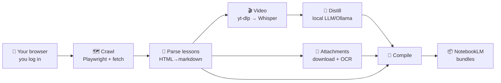

<h1 align="center">🧠 CourseMind</h1>

<p align="center">
  <b>Turn any online course you have access to into a private, LLM-queryable knowledge base — locally, for $0.</b>
</p>

<p align="center">
  
  
  
</p>

---

<p align="center"></p>

## The problem

Great courses are locked inside video players and PDFs. You can't search them, can't ask them
questions, and re-watching a 90-minute recording to find one framework is painful. Meanwhile,
tools like NotebookLM are brilliant at answering questions over text — if only you *had* the text.

**CourseMind** bridges that gap. Point it at a course you're enrolled in, and it produces a
clean, structured markdown knowledge base — lesson text, **distilled video transcripts**, **extracted
PDF/slide content**, and every link/contact/form — ready to drop into NotebookLM or query with any LLM.

Everything runs on your own machine. No API bills, no uploading your paid content to a third party.

## What you get

```
output/
├── lessons/              # one markdown file per lesson, grouped by section
├── notebooklm/           # consolidated per-section bundles — upload these to NotebookLM
├── _INDEX.md             # clickable map of the whole course
└── PROTOCOLS.md          # auto-aggregated contacts, forms, and resource links
```

Each lesson file contains the portal text, a **distilled transcript** of its video, the **extracted text
of its attachments**, and all resource links — verbatim.

## How it works



1. **Crawl** — opens *your* browser so *you* log in (the tool never sees your password), then walks the
   course graph with authenticated `fetch()`, following in-lesson links to catch branching content.
2. **Transcribe** — pulls each video's audio with `yt-dlp` and transcribes it locally with Whisper
   (Apple-Silicon `mlx-whisper`, or `openai-whisper` elsewhere).
3. **Distill** — a local LLM (via Ollama) condenses each transcript into tight study notes, keeping
   links/resources verbatim. Full raw transcripts are retained on disk.
4. **Extract** — downloads attachments and pulls their text (PDF, OCR fallback, xlsx, pptx, docx).
5. **Compile & bundle** — assembles everything into per-lesson markdown and per-section NotebookLM bundles.

## Quickstart

**Prerequisites** (one-time): [Python 3.9+], [ffmpeg], [Ollama] (for distillation),
`poppler` + `tesseract` (for PDF/OCR).
```bash
brew install ffmpeg poppler tesseract        # macOS
ollama pull gpt-oss:20b                       # or any local model you like
```

**Install:**
```bash
git clone https://github.com/M19K/CourseMind && cd CourseMind
python -m venv .venv && source .venv/bin/activate
pip install -r requirements.txt
playwright install chromium
```

**Run — the web UI (recommended):**
```bash
streamlit run app.py
```
Enter your course URL, hit **Start**, log in when the browser opens, and watch it work. Download the
result when it's done.

**Run — the CLI:**
```bash
cp config.example.yaml config.yaml   # then edit it
python -m coursemind.run --config config.yaml
```

## Configuration

Everything lives in `config.yaml` (see `config.example.yaml`): the course URL, whether to transcribe
video, which Whisper/LLM models to use, politeness pacing, OCR, and more.

## ⚖️ Ethical & legal use

CourseMind is a **personal-productivity tool for content you are legitimately entitled to access** —
like `yt-dlp` or a read-later app. It automates *your own* logged-in session to make *your own* learning
more efficient.

- **Do not** redistribute extracted content. Course material belongs to its creator; the `.gitignore`
  is configured so no downloaded content is ever committed.
- **Do not** use it to circumvent access controls or scrape content you haven't paid for.
- Respect each platform's Terms of Service. You are responsible for how you use this tool.

## Limitations

- Tuned for **Kajabi-style** courses (`/products/…/categories/…/posts/…`) with Wistia video. Other
  platforms need an adapter.
- Video transcripts in the corpus are **distilled** (summarized); full verbatim transcripts are kept
  on disk separately.
- Image-only content (diagrams, visual portfolios) isn't OCR'd inside lessons.

## Learn more

- 📐 [Architecture](docs/ARCHITECTURE.md) — how the pipeline is put together and why
- 📝 [Product case study](docs/CASE-STUDY.md) — the problem, the decisions, the trade-offs

## License

MIT — see [LICENSE](LICENSE).
